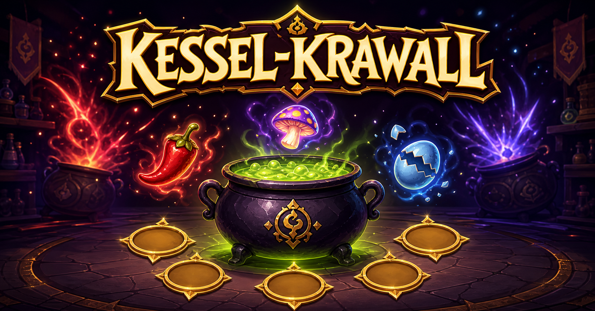
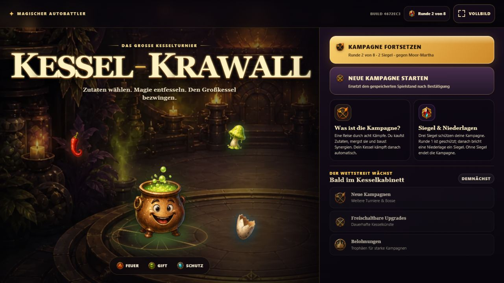
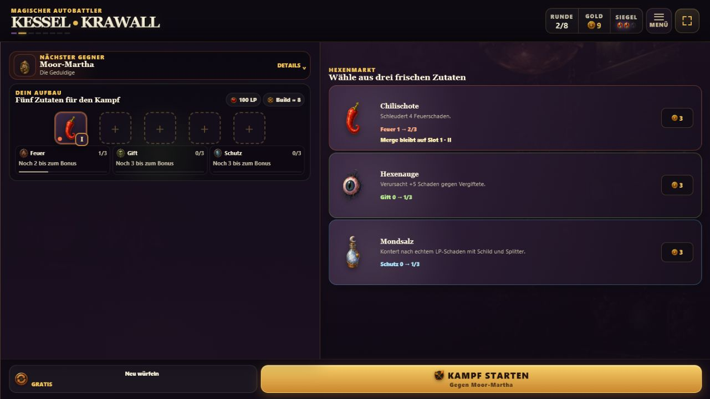

# Kessel-Krawall

[](https://kessel-krawall.netlify.app/)
[](https://emfau88.github.io/KesselKrawall/)



**Kessel-Krawall ist ein zugänglicher Mobile-Autobattler über einen magischen
Kessel, fünf Zutatenplätze und möglichst wirkungsvolle Kettenreaktionen.**

Im Hexenmarkt kaufst du Zutaten, verschmilzt gleiche Exemplare zu stärkeren
Stufen und kombinierst Familien wie Feuer, Gift, Schutz, Frost und Echo.
Danach kämpft dein Kessel automatisch – und zeigt unmittelbar, ob dein Aufbau
funktioniert.

## Direkt spielen

[**Kessel-Krawall auf Netlify öffnen**](https://kessel-krawall.netlify.app/)

Als unabhängiger Spiegel bleibt die
[GitHub-Pages-Version](https://emfau88.github.io/KesselKrawall/) erreichbar.

Das Spiel läuft ohne Installation im Browser. Der Kampagnenstand wird lokal auf
dem Gerät gespeichert.

Die Oberfläche ist vollständig auf **Deutsch und Englisch** spielbar. Beim
ersten Besuch wird die Browsersprache verwendet; danach bleibt die Auswahl aus
den Einstellungen lokal auf dem Gerät gespeichert. Spielstand und Sprache sind
bewusst getrennt, sodass ein Sprachwechsel keinen Run verändert.

## Ingame-Eindrücke

<p align="center">
  
  
</p>

<p align="center">
  <em>Startscreen mit animiertem Kessel · Hexenmarkt mit Angeboten, Aufbau und Synergien</em>
</p>

## Der Spielablauf

1. **Einkaufen:** Wähle im Hexenmarkt aus drei angebotenen Zutaten.
2. **Aufbauen:** Belege fünf Plätze und ordne deinen Kessel per Tap um.
3. **Mergen:** Zwei gleiche Zutaten verschmelzen automatisch bis Level III.
4. **Parken:** Ab Runde 5 hält eine passive Ablage genau eine Zutat für später.
5. **Synergien bilden:** Kombiniere Feuer, Gift und Schutz sowie
   Nachbarschaftseffekte.
6. **Kämpfen:** Dein Aufbau tritt automatisch gegen den nächsten Kessel an.
7. **Anpassen:** Nutze Ergebnis und Itemstatistiken für die nächste Runde.

Jede Kampagne führt über sieben Gegner zu einem eigenen Boss. Drei
Schutzsiegel verzeihen Fehler, aber nicht unbegrenzt. Nach dem Großkessel
öffnet sich das frostgebundene Archiv als zweite Kampagne.

## Zwei eigenständige Kampagnen

| Kampagne | Familienpool | Besonderheit | Boss |
| --- | --- | --- | --- |
| **Kessel-Krawall** | Feuer, Gift, Schutz | Der zugängliche Einstieg in Merges, Positionierung und Familien-Synergien | **Großkessel** mit Kesselzorn |
| **Das frostgebundene Archiv** | Frost, Echo und eine gewählte gemeisterte Familie | Kontroll- und Wiederholungs-Builds mit deutlich anderem Rhythmus | **Chronokessel** mit Zeitbruch |

Kampagne II wird nach dem ersten Kampagnenabschluss freigeschaltet. Jeder Run
beginnt weiterhin mit frischem Gold, leeren Plätzen und drei Schutzsiegeln.
Das Kesselkabinett speichert Freischaltungen, Trophäen und Bestleistungen,
verleiht aber bewusst keine dauerhaften Kampfkraft-Boni.

## Fünf Familien, klar getrennte Kampagnenpools

| Familie | Spielidee |
| --- | --- |
| **Feuer** | Direkter Schaden, Brand und aggressive Kettenreaktionen |
| **Gift** | Stapelbarer Druck; ab 10 Gift wird alles als sofortiger Toxinschock entladen |
| **Schutz** | Schilde, frühere Notfallheilung und begrenzte Trefferkonter über Mondsalz |
| **Frost** | Kontrolliert den gegnerischen Takt; jede dritte Aktivierung verzögert ihn |
| **Echo** | Wiederholt jede dritte Aktivierung mit 55 % ihrer Wirkung |

Die zwanzig Zutaten sind datengetrieben definiert. Pro Kampagne bleiben genau
drei Familien aktiv, damit Shop und Synergien trotz wachsender Sammlung
lesbar bleiben. Position, Merge-Stufe, Familiengewicht und gegenseitige
Auslöser entscheiden darüber, wie sich ein Build im Kampf verhält.

### Neue Effekte im frostgebundenen Archiv

| Effekt | Wirkung | Darstellung im Kampf |
| --- | --- | --- |
| **Froststarre** | Jede dritte Frost-Aktivierung verzögert die gegnerische Ladezeit um 0,65 Sekunden. | Blauer Familien-Callout und ein eigener Eisrunen-Impuls am gegnerischen Kessel |
| **Nachhall** | Jede dritte Echo-Aktivierung wiederholt 55 % der ursprünglichen Wirkung. | Violetter Familien-Callout und ein eigener Echoimpuls am auslösenden Kessel |
| **Zeitbruch** | Unter 50 % Leben erhält der Chronokessel +15 % Kraft und verschiebt deinen Angriffstakt einmalig um 0,9 Sekunden. | Eigene Zeitbruch-Statusanzeige statt des Kesselzorn-Buffs |

Cooldown-Ringe folgen der tatsächlichen Aktivierungszeit. Dadurch bleiben
Frost-Verzögerungen und Zeitbruch sichtbar mit dem nächsten Angriff
synchronisiert, statt nur eine abstrakte Zahl einzublenden.

### Einheitliche Assets und Effekte

- Die neuen animierten Kessel verwenden wie die überarbeiteten Kessel aus
  Kampagne I quadratische 512×512-Quelldateien und dieselben responsiven
  Größenstufen. Besonders breite Silhouetten sind individuell feinjustiert.
- Zutaten und Gegnerporträts liegen einheitlich in 256×256 vor und werden in
  denselben Slots, Rahmen und Detailkarten dargestellt.
- Kampfprojektile nutzen feste Darstellungsstufen für Hauptangriffe,
  Standardangriffe und Nebenwirkungen. Die sichtbare Silhouette neuer Frost-
  und Echo-Projektile ist zusätzlich defensiv skaliert, damit kein einzelnes
  Projektil das Feld dominiert.
- Frostsplitter, Eisglocke, Reifuhr, Spiegelscherbe, Hallglocke und Zeitfaden
  besitzen eigene Projektilsilhouetten. Froststarre und Nachhall verwenden
  separate, bewusst kurze Ziel- beziehungsweise Aktivierungsimpulse.
- Kombinierte Schutz-Angriffe stellen Schutzaufbau und Geschoss getrennt dar,
  damit weder der Angriff noch der defensive Anteil visuell verschluckt wird.
- Jeder neue Gegner besitzt einen eigenen Kessel, eine eigene Farbwelt und
  fortlaufende Partikelanimationen. Trefferreaktionen unterbrechen die
  Partikel nicht.
- Ein K. O. erhält einen eigenen visuellen Abschluss: Der besiegte Kessel
  zuckt zusammen, stößt einen kurzen Ring- und Funkenimpuls aus und dunkelt
  anschließend ab, bevor die Ergebnisansicht übernimmt.

## Aktueller spielbarer Stand

- zwei Kampagnen mit je acht Kämpfen, eigenen Gegnern und Bossregeln
- zwanzig Zutaten in fünf Familien, Merge-Kaskaden bis Level III
- Kesselkabinett mit Freischaltung, Trophäen und Kampagnenrekorden ohne
  dauerhafte Kampfkraft-Boni
- Kampagne II kombiniert Frost und Echo mit einer gewählten gemeisterten
  Familie aus Feuer, Gift oder Schutz
- fünf per Tap umsortierbare Zutatenplätze
- eine passive, ab Runde 5 freigeschaltete Ablage für genau eine Zutat
- Shop, Verkauf, neue Angebote und lokale Spielstand-Speicherung
- antippbare Item-Detailkarten mit aktuellem Kampftakt, Synergiefortschritt
  sowie verständlichen Hinweisen auf Buff-Quellen und betroffene Zutaten
- fünf Familien-Synergien mit eigenen Kampfeffekten und Nachbarschaftsregeln
- deterministische Kampfsimulation mit klarer visueller Präsentation
- eigene, gedrosselte Familienklänge für Frost und Echo sowie gemeinsame
  Normal- und Bosskampfmusik in beiden Kampagnen
- ab Runde 2 standardmäßig 2× Kampftempo, sanfte Kesselhitze ab Sekunde 15
  und klarer Abschlussdruck in den letzten fünf Sekunden
- lesbare Kampfmeldungen, reaktive Lebensbalken und Itembeiträge nach der Runde
- individuelle Projektilgrafiken, gestaffelte Merge-Inszenierung und
  responsive Layouts
- eine eigenständige Desktop-Werkbank im Hexenmarkt mit interaktivem Kessel,
  Ritualkreis und kompakten Aktionsbuttons; die mobile Vorbereitung bleibt
  bewusst platzsparend
- Fullscreen-Modus, Safe Areas und große Touchziele für moderne Smartphones
- vollständige DE/EN-Lokalisierung für Menüs, Kampagnen, Gegner, Zutaten,
  Tooltips, Kampfmeldungen und barrierefreie Beschriftungen

## Produktvision

Kessel-Krawall soll kleiner und schneller verständlich sein als große
Synergie-Autobattler, aber denselben befriedigenden Kern besitzen: Ein guter
Kauf verändert nicht nur eine Zahl, sondern kann einen ganzen Build in Bewegung
setzen.

Dabei gelten fünf Leitlinien:

- **Vorbereitung ist das Spiel:** Kaufen, Mergen, Positionieren und Reagieren
  bilden die strategische Ebene.
- **Wenige Systeme, starke Wechselwirkungen:** Tiefe entsteht aus Items statt
  aus zusätzlichen Menüs und Ressourcen.
- **Jede Wirkung bleibt lesbar:** Schaden, Gift, Brand, Heilung, Schild und
  Synergien erhalten eindeutiges Feedback.
- **Mobile zuerst:** Große Touchziele, kurze Texte und kein
  Pflicht-Drag-and-drop.
- **Macht muss fühlbar sein:** Merges und Synergien erzeugen erkennbare Sprünge
  statt kaum sichtbarer Prozentsteigerungen.

## Technik und Architektur

- Next.js, React und TypeScript
- statischer Build für GitHub Pages
- getrennte, deterministische Kampfsimulation und UI-Präsentation
- datengetriebene Zutaten und Gegner
- leichtgewichtige, typisierte DE/EN-Sprachschicht ohne Serverabhängigkeit;
  Balancewerte bleiben sprachunabhängig und werden nur einmal gepflegt
- lokal versionierter Spielstand mit Validierung
- automatisierte Tests für Shop, Kampagne, Simulation, Kampfdarstellung und
  Übersetzungsabdeckung

Der statische Sprachansatz funktioniert unverändert auf GitHub Pages, Netlify,
Vercel und klassischem Static Hosting.

### CrazyGames-Paket

Für CrazyGames gibt es einen isolierten **Basic-Launch-Build** unter dem
englischen Titel **Cauldron Rumble**. Er nutzt dieselbe Codebasis, startet
standardmäßig auf Englisch, arbeitet ausschließlich mit relativen Asset-Pfaden
und blendet die eigenen Vollbildschalter aus, da CrazyGames die
Vollbildsteuerung übernimmt. Netlify und GitHub Pages bleiben davon
unverändert.

```powershell
npm.cmd run build:crazygames
```

Der Befehl erstellt `dist/crazygames/cauldron-rumble-crazygames-basic.zip` und
prüft dabei automatisch Dateianzahl, Paketgröße, ZIP-Wurzel, Ressourcenpfade,
Titel und Credits. Weitere Hinweise und der englische Einreichungstext stehen
in [`platforms/crazygames/README.md`](platforms/crazygames/README.md).

Die verbindlichen Produkt- und Spielregeln stehen in
[`docs/GAME_SPEC.md`](docs/GAME_SPEC.md).

## Lokale Entwicklung

Voraussetzung ist Node.js 22.13 oder neuer.

```bash
npm install
npm run dev
```

Der Entwicklungsserver läuft anschließend unter `http://localhost:3000`.

```bash
npm run typecheck
npm run lint
npm test
npm run build:pages
```

## Nächste Schwerpunkte

1. Frost, Echo und den Chronokessel anhand echter Runs weiter ausbalancieren
2. Schaden über Zeit und Schilde auf kleinen Bildschirmen noch deutlicher zeigen
3. Shop-Druck auf vollen Aufbauten und spätere Inhalts-Erweiterungen prüfen

Kessel-Krawall bleibt bewusst fokussiert: keine Figuren, kein Pathfinding,
keine komplizierten Rezepte und kein Echtzeit-PvP – dafür ein verständlicher
Loop mit möglichst viel Entscheidungstiefe pro Zutat.

## Audio-Credits

Musik von Fablefly Music und MintoDog sowie Sounds von ObsydianX, HZSMITH,
NSFRL und BMacZero. Quellen, Lizenzen und die vorgenommenen Bearbeitungen stehen in
[`public/assets/audio/ATTRIBUTION.md`](public/assets/audio/ATTRIBUTION.md).
